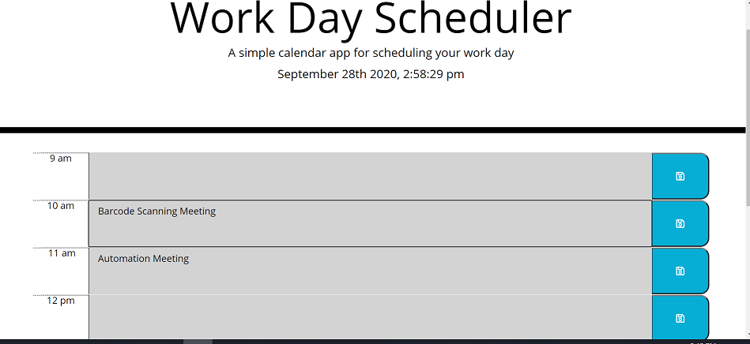

# day_scheduler

[Day Scheduler](https://kim-tor.github.io/day_scheduler/)
==================

# Description
Create a daily work schedule that can be updated for the current day. Calendar will indicate whether the time frame has passed and will also hold the values that are input by the user , even when the page is refreshed

# Implementation
To start I first added the current date to the header, using Moment.js to supply me with the format that I wanted to use for my date. 

I then created time-blocks in the html that would hold the time, the text and the save button. Once that was created I defined a time tracker function in my js file to be able to determine whether the time was past, present or future. Using the .each method to iterate through my time blocks I was able to compare each time block with the current time. Inside of that loop there is an if/else statement that determines which color will be displayed based on the comparison. 

Upon clicking the save button(which has an icon that I used from Font Awesome), the time and text that was input is stored in the local storage. 

# Credits
I attened office hours as well to get some help with the local storage I worked with my instructor and TA.

https://developer.mozilla.org/en-US/docs/Web/HTML/Element
https://api.jquery.com/each/
https://fontawesome.com/icons/save?style=regular
https://api.jquery.com/category/traversing/
https://learn.jquery.com/using-jquery-core/traversing/